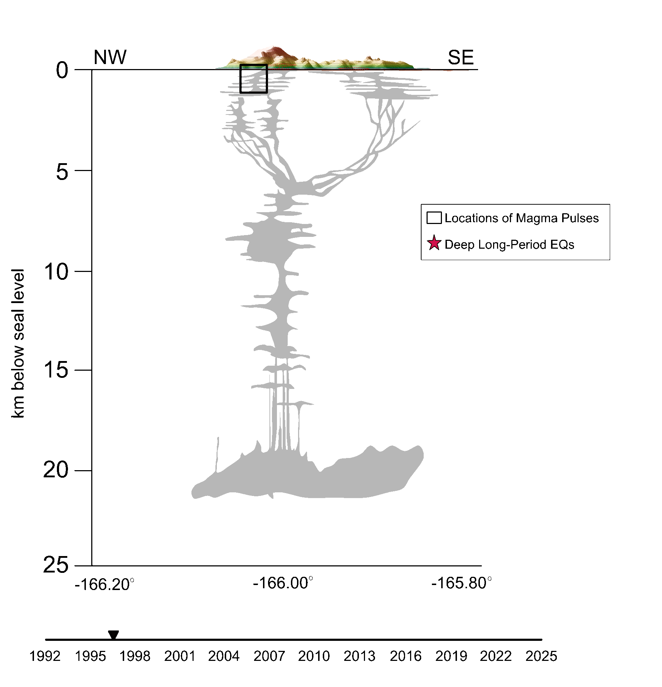

Petrologic and Geophysical Synthesis of the Magmatic System at Akutan Volcano

{ fig-alt="Animated diagram of subsurface structures comprising the magmatic system beneath Akutan Volcano width = 60%

}

Moss, M., Myers, M., Mark, H., Yang, X., Cheng, Y., Gapenthin, R., Lizik, Y., Portner, D., Lee, D., Wu, S., Larsen, J., Coombs, M., Petrologic and Geophysical Synthesis of the Magmatic System at Akutan Volcano. AGU Fall Meeting, New Orleans, LA, December 2025. (First Author, Presenting) 
